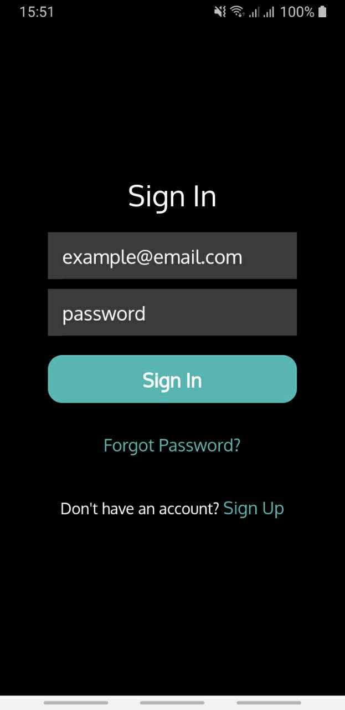
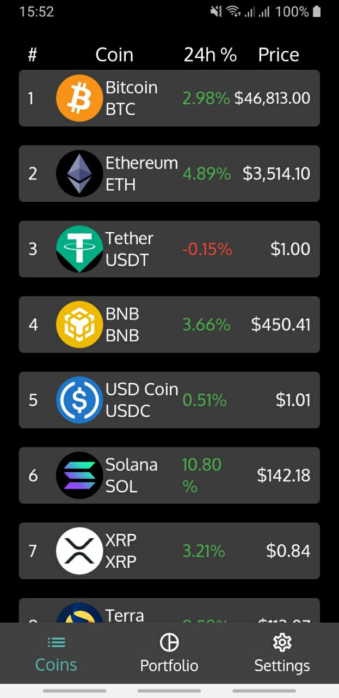
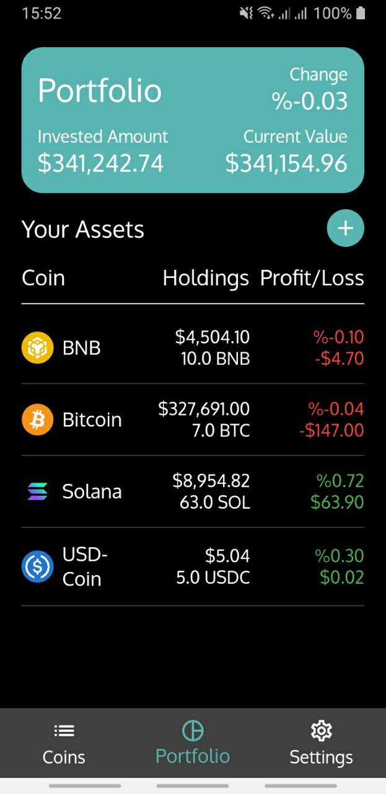
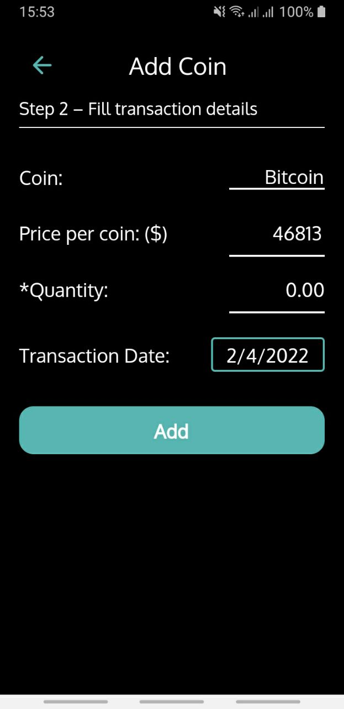
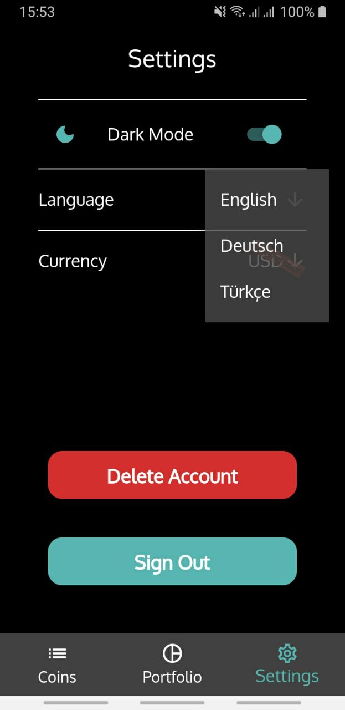

# Bit Holdings: Portfolio Track

Bit Holdings: Portfolio Track is a mobile portfolio tracking app for cryptocurrencies. This app allows you to track the performance of your cryptocurrency investments by fetching real-time cryptocurrency prices from CoinGecko. Although the app has been removed from the Google Play Store, you can still visit its GitHub repository for more information.

## Tech Stack

- Dart
- Flutter
- Firebase
- CoinGecko API

## Features

- Track popular cryptocurrencies and monitor their prices in real-time.
- Enter your transactions and track the performance of your cryptocurrency portfolio.
- Explore the latest prices and trends of various cryptocurrencies.
- Simple, fast, and easy to use.
- 100% free and without ads!
- Language options available: English, German, Turkish.

## Installation

To install and run Bit Holdings: Portfolio Track on your device, follow these steps:

1. Make sure you have Dart and Flutter installed on your system.
2. Clone the repository:
```git clone <repository_url>```
3. Navigate to the project directory:
```cd bit_holdings_portfolio_track```
4. Install the dependencies:
```flutter pub get```
5. Run the app:
```flutter run```

## Screenshots

    

## Contributions

Contributions to Bit Holdings: Portfolio Track are welcome! If you encounter any bugs or have suggestions for new features, please open an issue in the GitHub repository. You can also submit pull requests to contribute code improvements.
